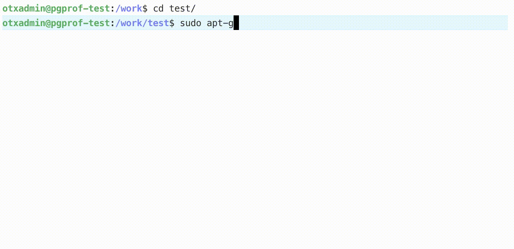

# pgprof: PostgreSQL Profiler
There are many benchmarking / profiling tools for measuring postgres database cluster performance. What is the purpose of yet another tool? 

1. Need for a modern lightweight application that ***mimics a microservice*** that requires backing postgres cluster
2. Has similar ***benchmarking capabilities*** of a tool such as `pgbench` 
3. Some ***data analysis capability built-in*** for extracting cluster performance as viewed from an application's perspective.

## TL; DR
<tldr>

</tldr>
<cmds>

```sh
sudo apt-get install virtualenv
virtualenv --python=python3 --prompt="[ pgpy ] " ${PWD}
git clone https://github.com/higgsmass/pgprof.git
source bin/activate && cd pgprof
pip install -r requirements.txt
python setup.py build && python setup.py install
pgprof-start
```
</cmds>

## Installation
It requires the following: 

* `Python >= 3.4` which is available with most OS distributions
* `psycopg2 >= 2.8.5, python-lorem >= 1.1.2` and their dependencies
* `pip,virtualenv` optionally if you want a lightweight virtual environment

Here the assumption is the `pgprof` application is intended to be installed either  in a docker container or a standalone VM or node *distinct from* the node or instance hosting a PostgreSQL cluster/server. To see which postgres versions are supported refer the [psycopg2 documentation](https://www.psycopg.org/docs/install.html#build-prerequisites). For clarity the installation instructions indicate  `test:~$ ` prompt to denote these steps are done on the "test VM or docker instance" which is also the application server.

### For *debian* based systems

* Setup a self-contained virtual environment

	```
	test:~$ sudo apt-get install virtualenv
	test:~$ virtualenv --python=python3 --prompt="[ pgpy ] " ${PWD}
	```
* Clone or get otherwise download and copy pgprof 

	```
	test:~$ git clone https://github.com/higgsmass/pgprof.git
	test:~$ source bin/activate
	```

* Install pre-requisites and setup `pgprof`

	```
	[ pgpy ] test:~$ cd pgprof
	[ pgpy ] test:~/pgprof$ pip install -r requirements.txt
	[ pgpy ] test:~/pgprof$ python setup.py build && sudo python setup.py install

	```

If all goes well the binaries are installed in `bin/{benchpg,pgprof-start}` and library in `lib/python3.?/site-packages/pgprof*` and you can proceed to testing.


## Testing 
Try the entry-point script first, you should see the import succeed. Then try `benchpg` and subcommands. 

```
[ pgpy ] test:~/pgprof$ pgprof-start
import pgprof.pgprof succeeded
[ pgpy ] test:~/pgprof$ benchpg initdb --help
no database url specified
```

### Usage
In order to invoke `benchpg` script, one needs an environment variable called **PGDSN** to be set. This specifies the Data Source Name (DSN) of the postgres cluster or standalone postgres server you want to connect the application to. If not specified it will return an error message "**no database url specified**" as you saw above. Follow the instructions below to setup a **postgres database and a role** required by `benchpg` on the postgres cluster you want this application to connect to.

#### Preparing PostgreSQL Server
This requires elevated access (`user = postgres`) to postgres database. Login to the postgres server and create a DATABASE=`benchdb` for a USER=`benchuser` so that the `pgprof` application can (a) connect to and (b) bootstrap a schema, table and view for usage.

Connect to `host=postgres` server as `user=postgres` to `database=postgres` and replace *'your-secret'* in the instructions below with a safe password of your choice. And the host and password will be used by `pgprof` to connect to the database. 
 
```sql
postgres@primary:~$ psql -U postgres -d postgres
postgres=# DROP DATABASE IF EXISTS benchdb;
DROP DATABASE
postgres=# DROP USER IF EXISTS benchuser;
DROP ROLE
postgres=# CREATE USER benchuser WITH LOGIN CREATEDB ENCRYPTED PASSWORD 'your-secret';
CREATE ROLE
postgres=# CREATE DATABASE benchdb WITH OWNER = benchuser ENCODING 'UTF-8' CONNECTION LIMIT = 20;
CREATE DATABASE
postgres=# \c benchdb;
psql (12.2 (Ubuntu 12.2-2.pgdg18.04+1), server 11.7 (Ubuntu 11.7-2.pgdg18.04+1))
You are now connected to database "benchdb" as user "postgres".
benchdb=# CREATE EXTENSION IF NOT EXISTS "uuid-ossp";
CREATE EXTENSION
benchdb=# \q
postgres@primary:~$ 
```
Alternatively, one can include all of the above commands into a single (for example `app.init.sql`) script and invoke it as follows

```sql

postgres@primary:~$ psql -U postgres -d postgres -f app.init.sql
DROP DATABASE
DROP ROLE
CREATE ROLE
CREATE DATABASE
psql (12.2 (Ubuntu 12.2-2.pgdg18.04+1), server 11.7 (Ubuntu 11.7-2.pgdg18.04+1))
You are now connected to database "benchdb" as user "postgres".
CREATE EXTENSION
postgres@primary:~$ 
```

#### Optional Security Step
##### SCRAM Authentication 
For my own usage and testing, I have upgraded/enabled the password based authentication to use SCRAM by referring [this blogpost](https://info.crunchydata.com/blog/how-to-upgrade-postgresql-passwords-to-scram) from Crunchy Data. If you do, make sure you test out the connection and add the `pg_hba.conf` entry on the postgres server in order for the application to access it using this method. It is considered a safer approach.


 
#### Invoking *`pgprof`* Application
To connect the application to database, you need to set an environment variable **PGDSN** on the `test` VM. The example used here has a `host=primary` and `password=your-secret`. You may want to change these appropriately based on your host IP / FQDN and the password you chose.

```sh
[ pgpy ] test:~/pgprof$ export PGDSN="dbname='benchdb' user='benchuser' host='primary' password='your-secret'"
```

Now we are ready to test / run the application.

```sh
[ pgpy ] test:~/pgprof$ benchpg --help
usage: benchpg [-h] [-l {DEBUG,INFO,WARNING,ERROR,CRITICAL}] [-p] [-q]
               {initdb,rwops} ...

optional arguments:
  -h, --help            show this help message and exit
  -l {DEBUG,INFO,WARNING,ERROR,CRITICAL}, --log {DEBUG,INFO,WARNING,ERROR,CRITICAL}
                        set log level [ default = INFO ]
  -p, --prompt          prompt before execution [ default = False ]
  -q, --quiet           execute in quiet mode [ default = False ]

Commands:
  {initdb,rwops}        sub-command help
```

### Sub-commands / Options

There are two subcommands. The first is `initdb` which bootstraps the schema, table and view required by `pgprof` application. The second is `rwops` which is basically a CRUD operations (read/write ops) generator that can be used for benchmarking / testing performance of the postgres cluster.

#### Bootstrapping `pgprof` Schema

```sh
[ pgpy ] test:~/pgprof$ benchpg initdb --help
usage: benchpg initdb [-h] [-s SCHEMA]

optional arguments:
  -h, --help            show this help message and exit
  -s SCHEMA, --schema SCHEMA
                        path to database schema [ example =
                        /path/to/my_app_schema.sql, default = ./schema.sql ]

                      
[ pgpy ] test:~/pgprof$ benchpg initdb -s ${PWD}/pgprof/appschema.sql

--------------------+------------------
Arguments           | Values
--------------------+------------------
loglevel            | INFO
prompt              | False
quiet               | False
command             | initdb
schema              | pgprof/appschema.sql
--------------------+------------------
2020-05-14 19:14:08,250 creating schema from file pgprof/appschema.sql
2020-05-14 19:14:08,280 done creating schema
```
Once the schema=`pgfailover` is created in database=`benchdb`for user=`benchuser`, you can verify the DDL. There are two functions=, a table, a view and a trigger (on insert) created by  `appschema.sql` script for bootstrapping. 

The table has three columns: timestamp`=ts`, id`=id` (also a uuid-based primary key) and status`=status`, a view and a trigger on insert is defined to automatically populate the `current_timestamp` and a unique `uuid` along with a `status=text` passed by `pgprof` application.

NOTE: Every INSERT statement results in an automatic generation of a unique primary key and a timestamp based on the trigger and stored functions called.


```sql
benchdb=# set search_path to pgfailover,public;
SET
benchdb=# \df
                                 List of functions
 Schema |        Name        | Result data type |    Argument data types    | Type
--------+--------------------+------------------+---------------------------+------
 public | bench_trigger      | trigger          |                           | func
 public | random_text_md5    | text             | length integer            | func
 ...
 ...
 
 
 benchdb=# \dt
             List of relations
   Schema   |   Name   | Type  |   Owner
------------+----------+-------+-----------
 pgfailover | benchtab | table | benchuser
(1 row)

benchdb=# \d pgfailover.benchtab;
                      Table "pgfailover.benchtab"
 Column |            Type             | Collation | Nullable | Default
--------+-----------------------------+-----------+----------+---------
 ts     | timestamp without time zone |           | not null |
 id     | uuid                        |           | not null |
 status | text                        |           |          |
Indexes:
    "benchtab_pkey" PRIMARY KEY, btree (id)
Triggers:
    benchtab_bench_trigger BEFORE INSERT ON benchtab FOR EACH ROW EXECUTE PROCEDURE bench_trigger()


benchdb=# \dg
                                    List of roles
  Role name  |                         Attributes                         | Member of
-------------+------------------------------------------------------------+-----------
 benchuser   | Create DB                                                  | {}
 ...
 ...
 ...
 
benchdb=# SELECT event_object_table,trigger_name,event_manipulation,
> action_statement,action_timing FROM 
> information_schema.triggers ORDER BY event_object_table,event_manipulation;
-[ RECORD 1 ]------+----------------------------------
event_object_table | benchtab
trigger_name       | benchtab_bench_trigger
event_manipulation | INSERT
action_statement   | EXECUTE PROCEDURE bench_trigger()
action_timing      | BEFORE

benchdb=#

```
